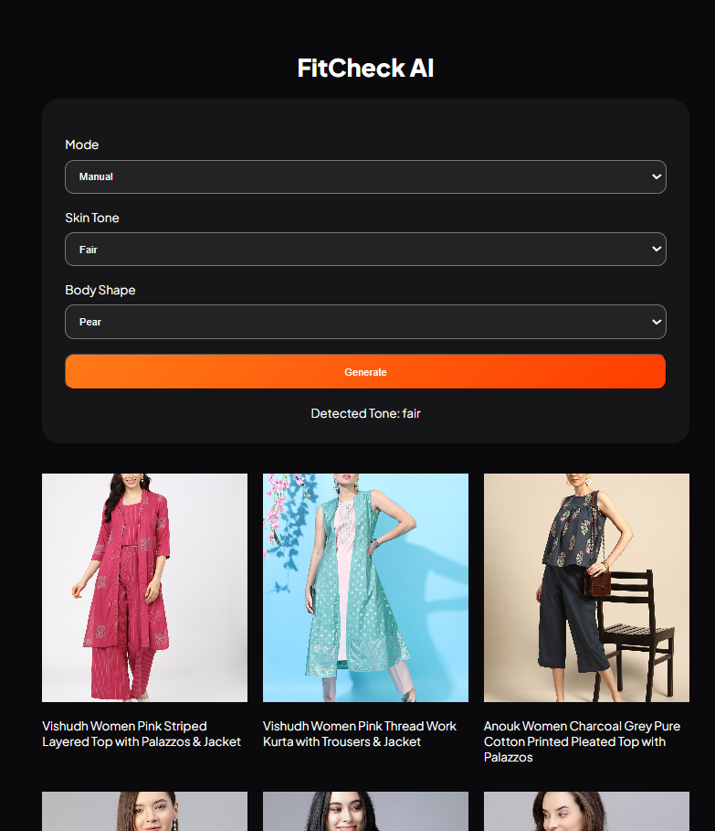
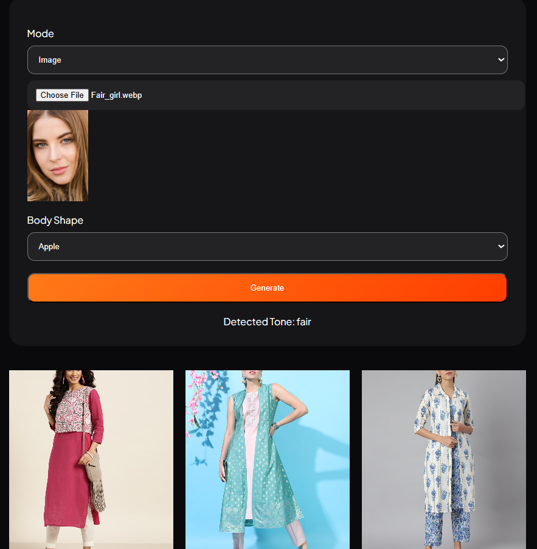
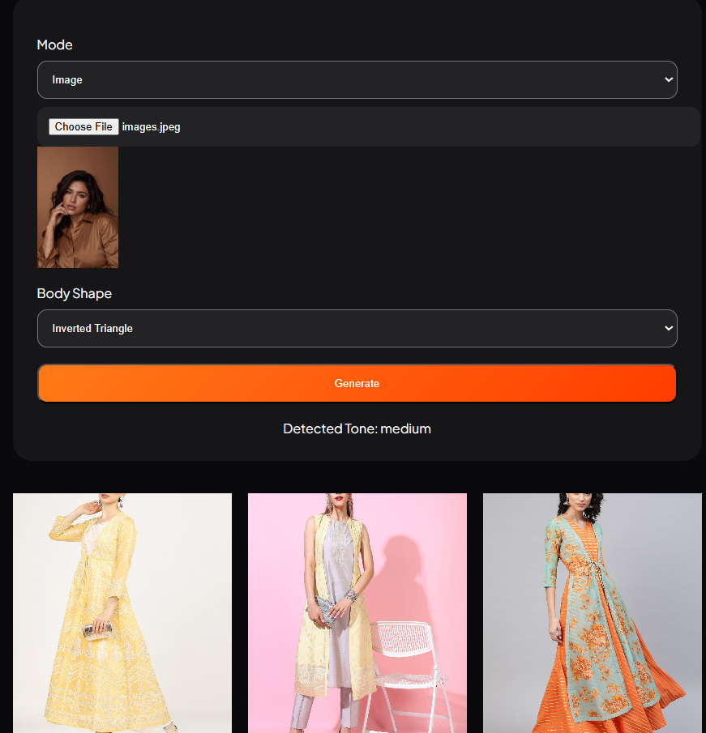
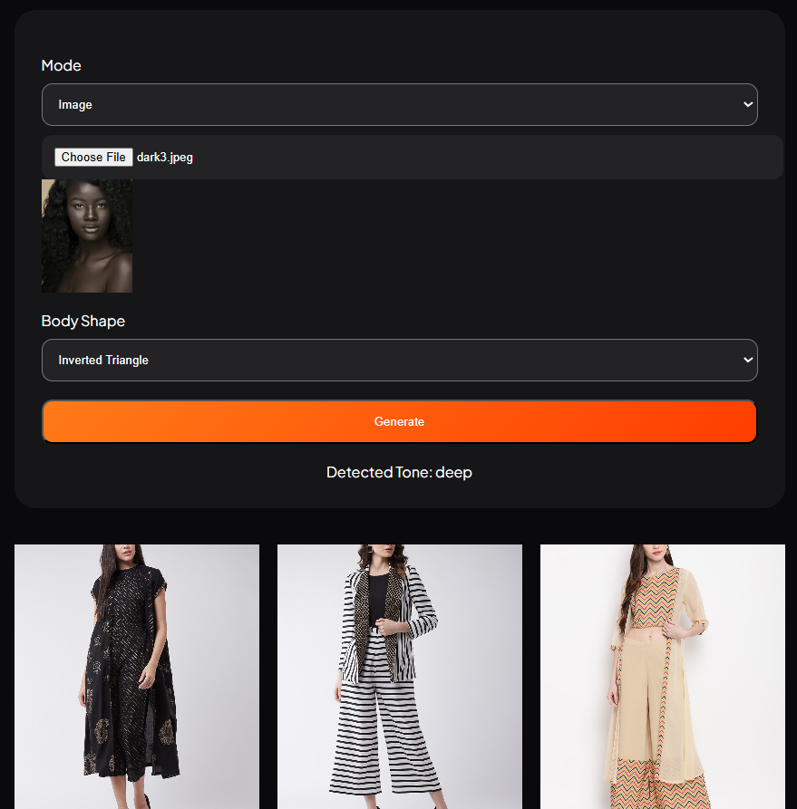
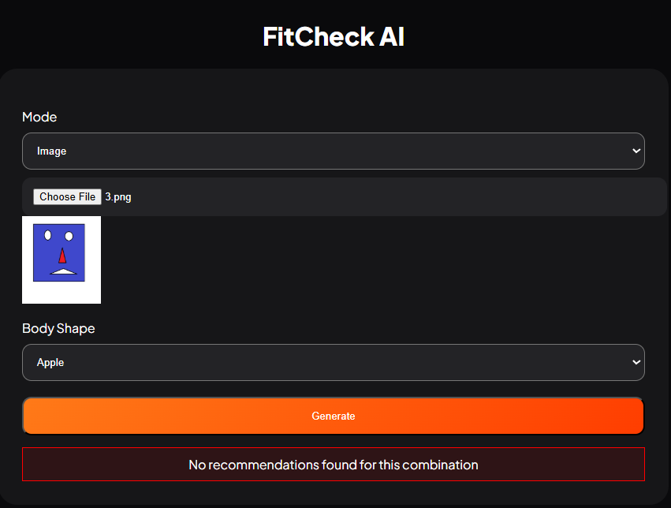

# FitCheck

fashion recommendation system that analyzes a user's **skin tone** and **body shape** to generate personalized outfit suggestions using Computer Vision and rule-based recommendation logic.

---

## 📌 Overview

FitCheck is a smart fashion styling web application developed using **Python, Flask, OpenCV, HTML, CSS, and JavaScript**.  
The system detects a user's skin tone from an uploaded image and combines it with body shape information to recommend suitable fashion items.

The project focuses on creating a lightweight and practical recommendation system without using heavy deep learning models.

---
## 📸 Application Preview

### 1️⃣ Manual Input Mode
Users can manually select their skin tone and body shape to receive personalized fashion recommendations.

---

### 2️⃣ Fair Skin Tone Detection
The system successfully detects fair skin tone from the uploaded image and generates suitable outfit suggestions.

---

### 3️⃣ Medium Skin Tone Detection
The application identifies medium skin tone and recommends matching fashion styles accordingly.

---

### 4️⃣ Deep Skin Tone Detection
The system detects deep skin tone and provides fashion recommendations optimized for darker tones.

---

### 5️⃣ Invalid Image Detection
If the uploaded image does not contain a valid human skin region (for example blue, pink, cartoon, or artificial colored images), the system rejects the input and displays an invalid skin tone message.

## ✨ Features

- Automatic skin tone detection from uploaded images
- Manual skin tone selection option
- Body shape-based fashion recommendations
- Skin tone classification:
  - Fair
  - Medium
  - Deep
- Invalid image detection for non-human or artificial colored images
- Responsive and interactive frontend UI
- Flask API integration for backend processing
- Fast and lightweight image processing using OpenCV

---

## 🧠 System Workflow

1. User uploads an image or selects manual input mode
2. Face detection is performed using Haar Cascade Classifier
3. A center skin region is extracted from the detected face
4. Skin validation is performed using:
   - HSV Color Space
   - YCrCb Color Space
5. Brightness is calculated using luminance analysis
6. Skin tone is classified into Fair, Medium, or Deep
7. Recommendations are generated based on:
   - Skin Tone
   - Body Shape

---

##  Problem Solved

Earlier versions of the system classified bright non-skin images such as blue, pink, or white drawings as "fair" because the classification relied only on brightness analysis.

To solve this issue, skin validation logic was introduced using HSV and YCrCb color space filtering to ensure that only actual human skin regions are processed.

---

## 🛠️ Technologies Used

### Frontend
- HTML
- CSS
- JavaScript

### Backend
- Python
- Flask
- Flask-CORS

### Libraries
- OpenCV
- NumPy
- Pandas

---

